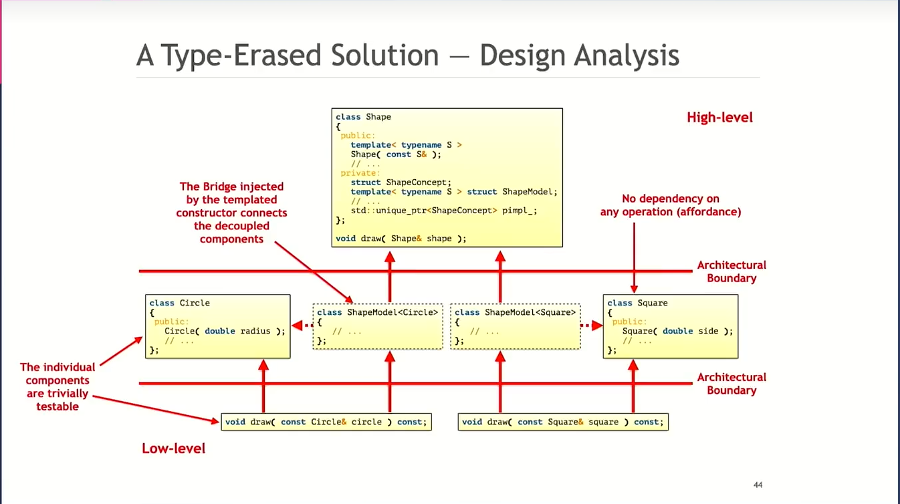

## Design Analysis

## Type Erasure is:
- A templated constructor plus
- A completely non-virtual interface 
- External Polymorphism + Bridge + Prototype

## Type Erasure 
- Significantly reduces dependencies
- Enables value semantics
- Improves performance 
- Improves readability and comprehensibility 
- Eases maintenance
