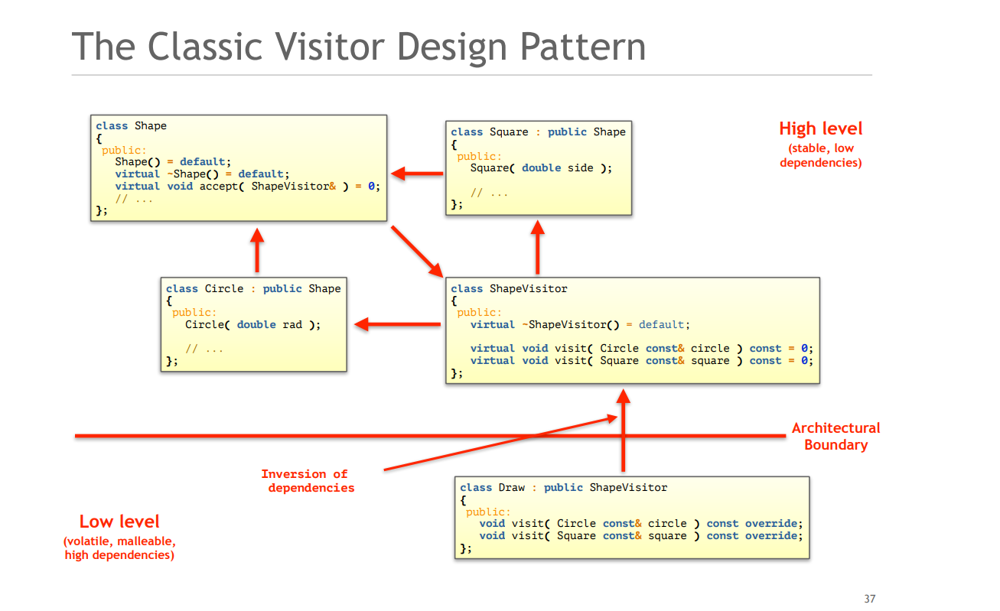
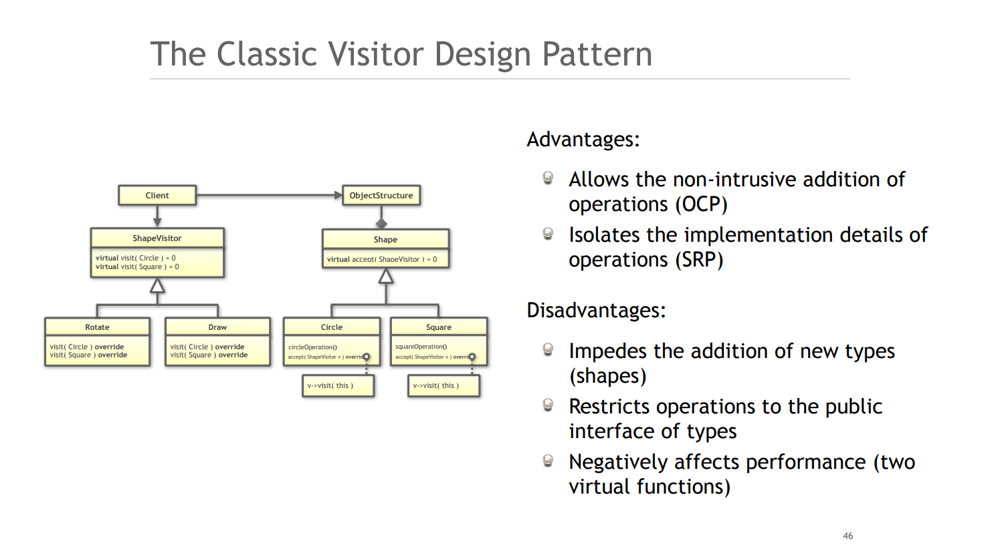
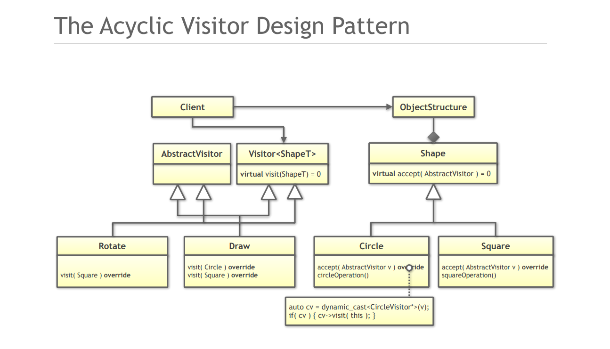
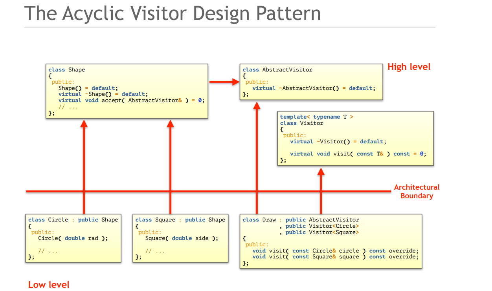

## Introduction
In dynamic polymorphism you have to make a choice:
- Design for the addition of types
- Design for the addition of operations
### Design for the addition of types
Type Erasure - Implementation Details
### Design for the addition of operations
Changing interface in OOP is difficult

OOP is the **WRONG** choice if you need to add operations

## Classic Visitor Design Pattern
### Advantages:
- Allows the non-intrusive addition of operations (OCP)
- Isolates the implementation details of operations (SRP)
### Disadvantages:
- Impedes the addition of new types (shapes)
- Restricts operations to the public interface of types
- Negatively affects performance (two virtual functions)
### Implementation-specific disadvantages:
- Base class required (intrusive)
- Promotes heap allocation
- Requires memory management




## Acyclic Visitor



## A "Modern C++" Solution - std::variant
```C++
// No base class required 
// Operations can be non-intrusively be added (OCP)
class Draw
{
public:
    void operator()(Circle const& circle) const;
    void operator()(Square const& square) const;
    void operator()(Ellipse const& ellipse) const;
};
using Shape = std::variant<Circle, Square>;
using RoundShape = std::variant<Circle, Ellipse>;
void drawAllShapes(std::vector<Shape> const& shapes)
{
    for (auto const& s : shapes)
    {
        std::visit(Draw{}, s);
    }
}
```
- There is no inheritance hierarchy (non-intrusive)
- No cyclic dependency (implementation flexibility)
- The code is so much simpler
- There are no virtual functions
- There are no pointers or indirections
- There is no manual dynamic memory allocation
- There is no need to manage lifetime

## Conclusions
- The Visitor design pattern is the right choice if you want to add operations.
- The Visitor design pattern is the wrong choice if you want to add types.
- Prefer the value-semantics based implementation based on std::variant.
- Beware the performance of Acyclic Visitors

